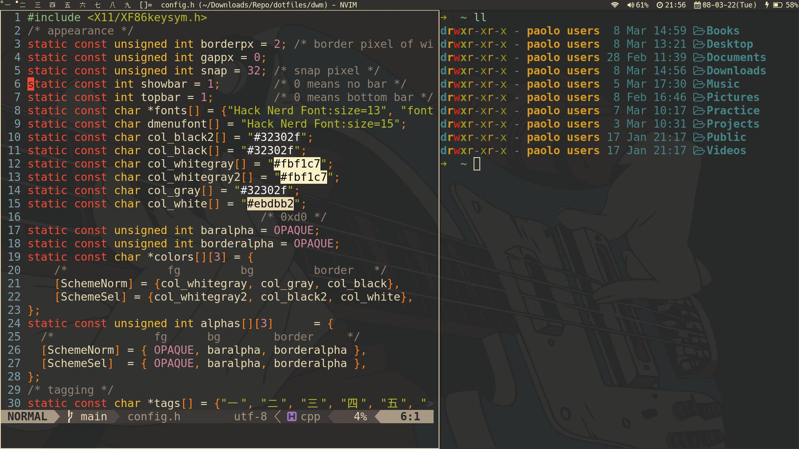

# Welcome to my dotfiles
I'm using [Arch Linux](https://wiki.archlinux.org/title/Arch_Linux) as my daily driver
and [dwm](https://wiki.archlinux.org/title/Dwm) for my desktop environment.

## Tools used
- [Fish Shell](https://github.com/fish-shell/fish-shell) - fish is a smart and user-friendly command line shell for macOS, Linux, and the rest of the family. fish includes features like syntax highlighting
- [Tmux](https://github.com/tmux/tmux) - tmux is an open-source terminal multiplexer for Unix-like operating systems. It allows multiple terminal sessions to be accessed simultaneously in a single window.
- [Alacritty](https://github.com/alacritty/alacritty) - Alacritty is a modern terminal emulator that comes with sensible defaults, but allows for extensive configuration. The font I'm using is called [Hack Mono Nerd Font](https://github.com/ryanoasis/nerd-fonts/blob/master/patched-fonts/Hack/Regular/complete/Hack%20Regular%20Nerd%20Font%20Complete%20Mono.ttf).
- [Neovim](https://github.com/neovim/neovim) - It is an enhanced out of the box version of the Vim text editor or you can say, it is a more simplified Vim which makes integrations much easier than with Vim.
- [Picom](https://github.com/yshui/picom) - picom is a standalone compositor for Xorg, suitable for use with window managers that do not provide compositing.
- [mpd](https://wiki.archlinux.org/title/Music_Player_Daemon) - (music player daemon) is an audio player that has a server-client architecture. It plays audio files, organizes playlists and maintains a music database, all while using very few resources. In order to interface with it, a separate client is needed. 
- [ncmpcpp](https://wiki.archlinux.org/title/ncmpcpp) - is an mpd client (compatible with mopidy) with a UI very similar to ncmpc, but it provides new useful features such as support for regular expressions for library searches, extended song format, items filtering, the ability to sort playlists, and a local filesystem browser. To use it, a functional mpd must be present on the system since ncmpcpp/mpd work together in a client/server relationship. 
- [z](https://github.com/rupa/z) - Tracks your most used directories, based on 'frecency'.
- [exa](https://github.com/ogham/exa) - is a modern replacement for the venerable file-listing command-line program ls that ships with Unix and Linux operating systems, giving it more features and better defaults.
- [tide](https://github.com/IlanCosman/tide) - ultimate fish prompt.
- [peco](https://github.com/peco/peco) - can be a great tool to filter stuff like logs, process stats, find files, because unlike grep, you can type as you think and look through the current results.
- [emacs](https://www.gnu.org/software/emacs/) - Highly customizable, using Emacs Lisp code or a graphical interface. A wide range of functionality beyond text editing, including a project planner, mail and news reader, debugger interface, calendar, IRC client, and more. A packaging system for downloading and installing extensions. Built-in support for arbitrary-size integers.

